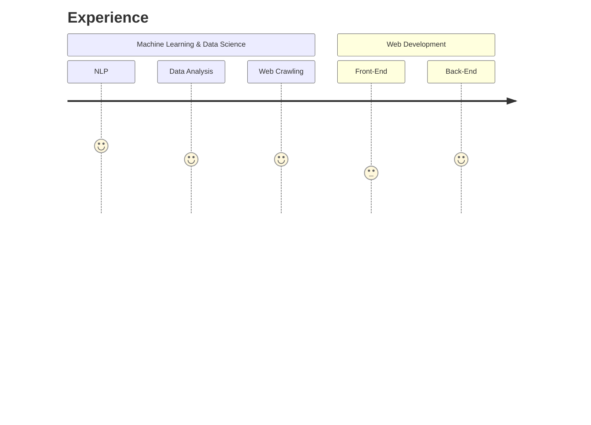

# About

## Profile

Ali Soltani Rad. 24 years old. Software Developer. Interested in data science, 
AI, machine learning, software engineering and open source projects.

## Education

**Computer Science**, _University of Tehran_

Undergraduate (B.Sc), since 2016.

## Skills

### Languages And Libraries:

**Python**

`django` `nltk` `scikit-learn` `keras` `numpy` `pandas` `matplotlib` 
`beautifulsoup`

**Web**

`html` `css` `javascript` `bootstrap` `jquery` `sql`

**Other**

`R`

### Concepts

**Machine Learning And Data Science**

`data-mining` `classification` `clustering` `regression` `deep-learning` 
`neural-networks` `cnn` `rnn` `natural-language-processing` `web-scraping` 
`web-crawling` `visualization`

**Programming**

`data-structures` `algorithms` `object-oriented-programming` `database-design`
`clean-code` `git` `linux`

**Software Engineering**

`software-design` `agile` `business-models`

## Certifications

**Agile With Scrum**

Udemy, _March 2020_  
[See credential](https://udemy-certificate.s3.amazonaws.com/pdf/UC-a44f3475-75b1-441f-bc52-e8f31daae56b.pdf){: target='_blank'}

**Business Plan**

Udemy, _March 2020_  
[See credential](https://udemy-certificate.s3.amazonaws.com/pdf/UC-6e440927-184f-4d92-91ec-46e864692c59.pdf){: target='_blank'}

**Project Management**

Udemy, _March 2020_  
[See credential](https://udemy-certificate.s3.amazonaws.com/pdf/UC-0a1c5790-9044-43a7-bf7a-b820021ff14a.pdf){: target='_blank'}

**Digital Marketing**

Google Digital Garage, _August 2019_  
[See credential](https://learndigital.withgoogle.com/digitalgarage/course/digital-marketing/certificate.pdf){: target='_blank'}

**Relational Database Design**

Udemy, _August 2019_  
[See credential](https://udemy-certificate.s3.amazonaws.com/pdf/UC-KOU1QL48.pdf){: target='_blank'}

## Open-Source Projects

See [Projects Page](https://alisoltanirad.github.io/tabs/projects/) or 
[Github Page](https://github.com/alisoltanirad){: target='_blank'}
